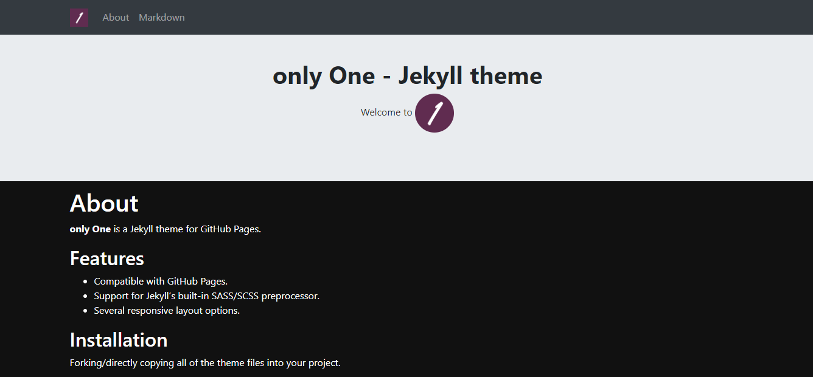

# **only One** Jekyll theme
`only One` is a Jekyll theme for GitHub Pages.




## Features

* Bundled as a "theme gem" for easier installation/upgrading.
* Compatible with GitHub Pages.
* Support for Jekyll's built-in Sass/SCSS preprocessor.
* Several responsive layout options.
* [Google Analytics](https://www.google.com/analytics/) support.


## Installation

There are three ways to install: as a [gem-based theme](https://jekyllrb.com/docs/themes/#understanding-gem-based-themes), as a [remote theme](https://blog.github.com/2017-11-29-use-any-theme-with-github-pages/) (GitHub Pages compatible), or forking/directly copying all of the theme files into your project.


## Customizing

### Gem-based method

With Gem-based themes, directories such as the `assets`, `_layouts`, `_includes`, and `_sass` are stored in the theme’s gem, hidden from your immediate view. Yet all of the necessary directories will be read and processed during Jekyll’s build process.

### Configuration variables

`only One` will respect the following variables, if set in your site's `_config.yml`:

```yml
title: [The title of your site]
description: [A short description of your site's purpose]
baseurl: [Prepend the baseurl value to the input]
```

Additionally, you may choose to set the following optional variables:

```yml
google_analytics: [Your Google Analytics tracking ID]
```

### Stylesheet

If you'd like to add your own custom styles:

1. Create a file called `/assets/css/style.scss` in your site
2. Add the following content to the top of the file, exactly as shown:
    ```scss
    ---
    ---

    @import "";
    ```
3. Add any custom CSS (or Sass, including imports) you'd like immediately after the `@import` line

*Note: If you'd like to change the theme's Sass variables, you must set new values before the `@import` line in your stylesheet.*

### Layouts

If you'd like to change the theme's HTML layout:

1. [Copy the original template](https://github.com/fingerLabs/only-One/blob/master/_layouts/default.html) from the theme's repository<br/>(*Pro-tip: click "raw" to make copying easier*)
2. Create a file called `/_layouts/default.html` in your site
3. Paste the default layout content copied in the first step
4. Customize the layout as you'd like

For more information, see [the Jekyll variables documentation](https://jekyllrb.com/docs/variables/).


## Contributing

Interested in contributing to `only One`? We'd love your help. `only One` is an open source project, built one contribution at a time by users like you. See [the CONTRIBUTING file](docs/CONTRIBUTING.md) for instructions on how to contribute.

### Previewing the theme locally

If you'd like to preview the theme locally (for example, in the process of proposing a change):

1. Clone down the theme's repository (`git clone https://github.com/fingerLabs/only-One`)
2. `cd` into the theme's directory
3. Run `bundle exec jekyll serve` to start the preview server
4. Visit [`localhost:4000/only-One/`](http://localhost:4000/only-One) in your browser to preview the theme

## Credits

### Creator

[`Finger Labs`](https://github.com/fingerLabs) by **Long Nhat Nguyen**

### Other

* [Jekyll](http://jekyllrb.com)
* [W3CSS](https://www.w3schools.com/w3css)
* [Minimal-mistakes](https://github.com/mmistakes/minimal-mistakes)

## License
[MIT](LICENSE.md)